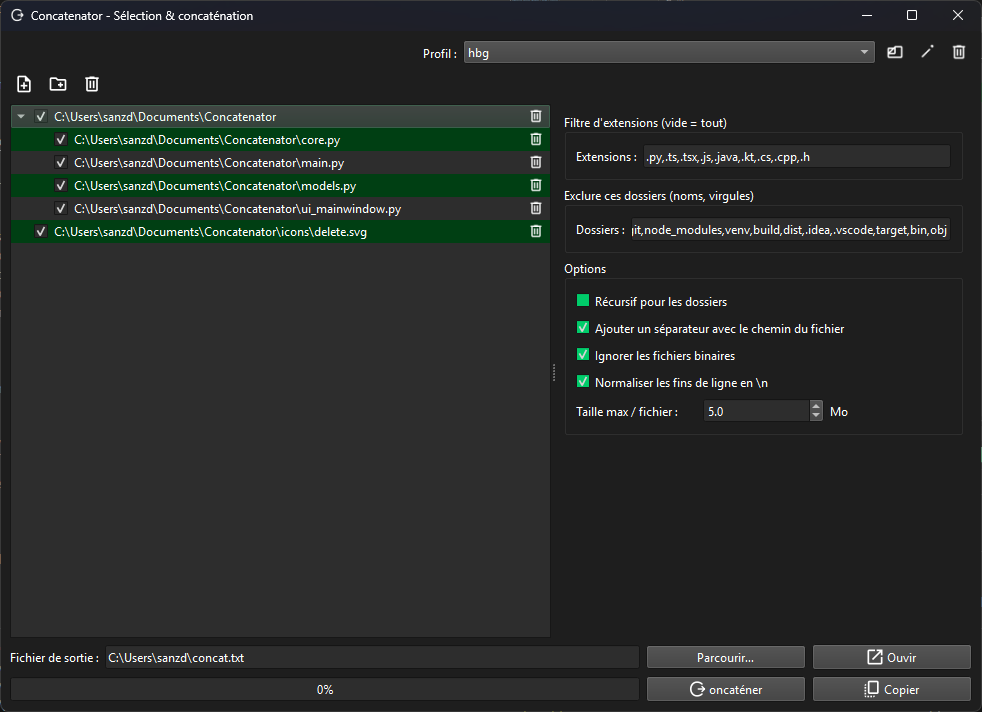

# 🚀 Concatenator — L’outil ultime pour fusionner vos fichiers texte

[](https://github.com/Molesox/Concatenator/actions/workflows/python-ci.yml)
[](https://github.com/Molesox/Concatenator/actions/workflows/release-multi-os.yml)

**Concatenator** est une application graphique moderne en **PySide6** pour rassembler le contenu de plusieurs fichiers texte en un seul, avec style et efficacité.  
Idéal pour développeurs, analystes ou toute personne travaillant avec de gros ensembles de fichiers.

✨ **Points forts** :
- Interface simple et intuitive
- Filtrage par extensions (`.py`, `.cpp`, `.java`, …)
- Exclusion de dossiers indésirables (`.git`, `node_modules`, …)
- Ignorer automatiquement les fichiers binaires
- Normaliser les fins de ligne (`\n`)
- Ajouter un en-tête avec le chemin source
- Sauvegarder et recharger vos profils de paramètres
- Barre de progression + copie directe dans le presse-papiers

---

## 🖼️ Captures d’écran



---

## 📥 Téléchargement

➡ **Dernière version (Windows / macOS / Linux)** :  
https://github.com/Molesox/Concatenator/releases/latest

| Système | Fichier | Notes |
|---|---|---|
| **Windows** | `Concatenator-<version>-windows.zip` ou `.exe` | Si SmartScreen s’affiche : “Plus d’infos” → “Exécuter quand même”. |
| **macOS** | `Concatenator-<version>-macos.zip` (contient `Concatenator.app`) | 1er lancement : clic droit → “Ouvrir” (app non signée). |
| **Linux** | `Concatenator-<version>-linux.tar.gz` ou binaire brut | Rendre exécutable : `chmod +x Concatenator-*` |

---

## ⚡ Utilisation rapide depuis les sources

```bash
git clone https://github.com/Molesox/Concatenator.git
cd Concatenator
pip install -r requirements.txt
python main.py
````

Ou installation directe comme package :

```bash
pip install .
concatenator
```

---

## 📦 Build local de l’exécutable

```bash
pip install pyinstaller
pyinstaller --noconfirm --onefile --windowed --name Concatenator main.py
# L'exécutable sera dans dist/
```

---

## 🏷️ Releases automatiques

Les builds multi-OS sont générés **automatiquement** quand vous poussez un tag version `vX.Y.Z` :

```bash
git tag v1.0.0
git push origin v1.0.0
```

Quelques minutes plus tard, la release est disponible sur GitHub.

---

## 📜 Licence

[MIT](LICENSE) — Utilisation libre, y compris commerciale.

 